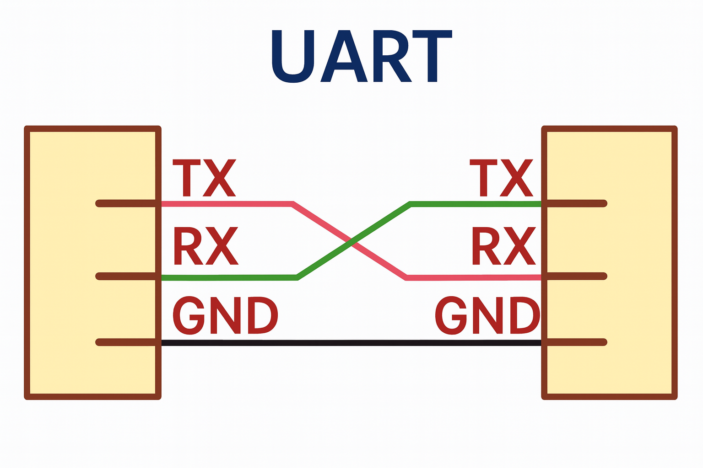
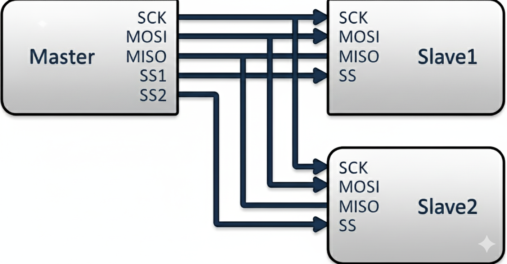

# 1. UART

## UART vs USART
### 직렬 통신, Full Duplex 구조
| 구분      | UART              | USART                             |
| ---------| ----------------- | --------------------------------- |
| 지원 방식 | 비동기              | 비동기 또는 동기                   |
| 클럭 사용 | ❌                | ⭕ 동기 모드에서 사용              |
| 범위     | 단순, 저속 통신      | 더 유연, 고속 통신 가능             |
| 관계     | UART만 지원         | UART 기능을 포함 (UART ⊂ USART)   |

## UART 통신
### 사용하는 방법

#### 보내는 속도, 받는 속도와 데이터 크기를 통일해야함
1. 시작 포인트 : Start Bit/Condition [1 Bit] → 0 [Always LOW]
2. 실제 Data : Data Bit → 5~9 bit 설정 가능
    - 사용되지 않는 비트는 전송 X → 수신기에서 0으로 처리
3. 오류 검출 : Parity Bit [1 Bit]
4. 끝나는 포인트 : Stop Bit [1~2 Bit 설정가능] → 1 [Always HIGH]
#### 수신기에서 받은 포맷을 읽고 원래의 데이터로 복원

## ATmega 128 송수신 구조
### 송수신 I/O 주소 같음
### 송신
1. UDRn에 데이터 쓰면 TXBn에 저장
2. UDREn Flag set일 때만 작성
3. 시프트 레지스터 비었을 때 시프트레지스터에 데이터 작성
4. TxDn 핀을 통해 직렬 통신
### 수신
1. UDRn에서 읽으면 RXBn의 내용 반환

---------------------------------------------------------------

# 2. SPI

## 특징
1. Full-Duplex, 직렬 통신
2. Three-wire **Synchronous** Data Transfer [고속 전송 가능]
3. Master/Slave Operation
4. 신호선 구성 - 선 개수 4개 이상 [MOSI, MISO, SCK, SS/CS]
    - Slave 수가 많아질수록 SS/CS 핀 많이 필요 
5. 시프트 레지스터 + 데이터 버퍼 레지스터

## 설정가능한 요소
1. LSB/MSB 중 데이터 전송 순서 결정 가능
2. CPOL : SCK 유휴 상태 결정
    - SCK 동작하지 않을 때 상태 정의
3. CPHA
    - 클록 에지에서 언제 데이터를 샘플링할지 제어

## 통신 방법
1. Master가 SCLK 생성
2. [CS/SS]를 LOW로 내리며 특정 Slave 선택
3. 마스터/슬레이브는 Shift Register에 데이터 준비
4. Master가 클록 발생 → MOSI/MISO 모두 데이터 이동
    - 전송할 Byte는 Shift 사이클 완료될 때까지 SPDR에 작성 안됨
    - 수신된 데이터가 버퍼에 들어가고 읽지 않고 놔두면 새로운 데이터가 들어와 덮어쓰기 됨.
4. 패킷 전송 끝나면 SS라인을 HIGH로 풀링하여 Slave 동기화

### ATmega128 구조
#### Master 기준
1. SW로 SS/CS 핀 지정 → LOW 
2. SPDR에 바이트 기록
3. 클록 동작 시작
4. 1 Byte를 Slave로 Shift
5. 클록 발생기 멈춤
6. SPIF Set → SPCR의 SPIE set 이라면 인터럽트 발생
7. SPDR에 다음 바이트를 기록하면 자동으로 이어서 전송 가능
    - 연속적인 바이트 전송은 SPDR에 계속 작성
7. 전송이 끝나면 SS/CS HIGH

#### Slave 기준
1. SS/CS 핀 HIGH → 선택되지 않은 상태
2. MISO 핀은 Tri-stated
    - SPDR 수정 가능하지만 데이터 전송
    - SS/CS 핀을 LOW 내리면 전송할 준비
3. 1 Byte 모두 Shift → SPIF set
    - 동시에 마스터가 보낸 데이터도 SPDR Buffer Register에 보관

## 실제 사용 예시
- Flash Memory
- LCD, OLED 디스플레이 제어
- 센서
- SD 카드 인터페이스

# 3. TWI

## 특징
1. Only Two Bus Lines Needed
2. Master/Slave Operation
3. 

